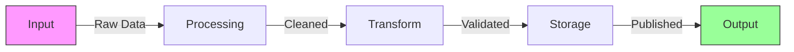
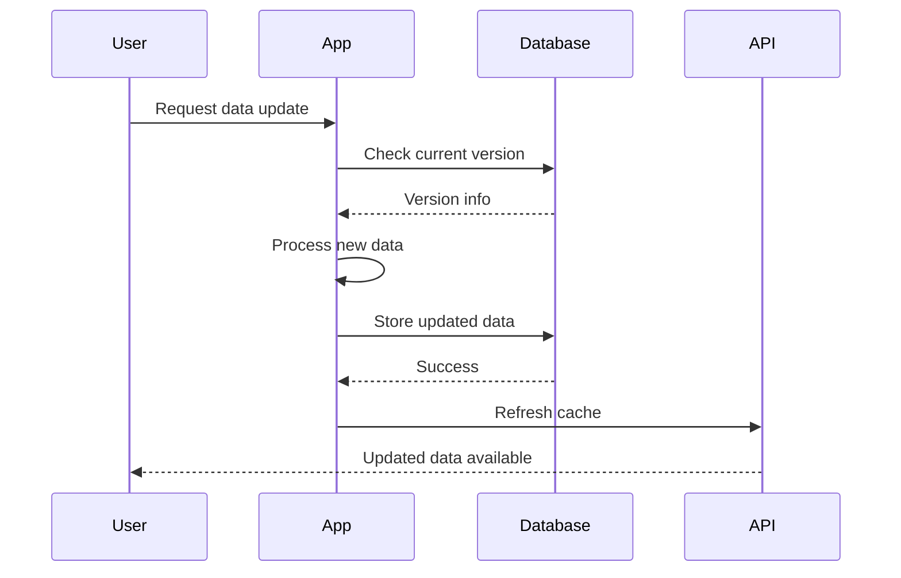
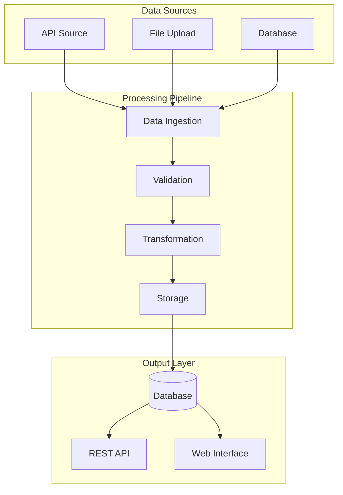

# Zensical Tips


## Admonitions

Call outs examples, can use Octocons and Fontawesome icons.

!!! NOTE "Note"

!!! ABSTRACT "Abstract"

!!! INFO "Information"

!!! tip "Tip"

!!! success "Success"

!!! question "Question"

!!! warning "Warning"

!!! failure "Failure"

!!! danger "Danger"

!!! bug "Bug"

!!! example "Example"

!!! QUOTE "Quote"


### Inline Admonitions

!!! info inline end "Sidebar Info"
    This admonition floats to the right side of the page, allowing text to flow around it.

Lorem ipsum dolor sit amet, consectetur adipiscing elit. Nulla et euismod nulla. Curabitur feugiat, tortor non consequat finibus, justo purus auctor massa, nec semper lorem quam in massa. This text wraps around the inline admonition.

Pellentesque habitant morbi tristique senectus et netus et malesuada fames ac turpis egestas. Vestibulum tortor quam, feugiat vitae, ultricies eget, tempor sit amet, ante.


## Buttons

Use styled buttons for calls to action:

[Choose A Bike :material-rocket-launch:](choosing-a-bike.md){ .md-button .md-button--primary }
[GitHub Repository :fontawesome-brands-github:](https://github.com/practicalli/cycling){ .md-button }
[Practicalli Website](https://practical.li/){ .md-button }


## Icons

Icon sets are bundled with Zensical.  Practicalli web sites mostly use Lucide for general icons and Octocons for GitHub specific icons.

[Lucide](https://lucide.dev/){target=_blank .md-button}
[Octicons](https://octicons.github.com/){target=_blank .md-button}

[Material Design](https://pictogrammers.com/library/mdi/){target=_blank .md-button}
[FontAwesome](https://fontawesome.com/search?m=free){target=_blank .md-button}
[Simple Icons](https://simpleicons.org/){target=_blank .md-button}


## Tool tips

The API endpoint processes requests through multiple stages.

*[API]: Application Programming Interface - A way for applications to communicate

> TODO: check if plugin required for tooltips


## Hyperlinks

[Link with Preview](bike-fit.md){ data-preview }. by adding `{ data-preview }` style after the URL

```markdown
[Link with Preview](bike-fit.md){ data-preview }
```


Zensical supports [hoverable tooltips](https://zensical.org "Click to learn more about Zensical!") using the title attribute.

```shell
[hoverable tooltips](https://zensical.org "Click to learn more about Zensical!")
```


### Reference-style Links

Use a reference style link where there are multiple links on a page for one URL.

Our [data API][api-ref] and [metadata system][metadata-ref].

[api-ref]: ../api/index.md
[metadata-ref]: ../architecture/metadata/index.md


## Images

Place a `!` character in front of a hyperlink form, with the URL being the address of the image and the text being the 'Alternative Text' (if they image does not download )

### Image with Caption

<figure markdown>
  { width="240" }
  <figcaption>Debian Linux Logo</figcaption>
</figure>

### Image Grid

<div class="grid" markdown>

{ width="200" }

{ width="200" }

{ width="200" }

</div>


## Keyboard Keys

Use ++ctrl+shift+r++ to hard refresh your browser and clear the favicon cache.

Common ETL commands:

- Run a step: ++ctrl+enter++
- Stop execution: ++ctrl+c++
- Search documentation: ++ctrl+k++ or ++cmd+k++

## Progress Bars

Track your ETL learning progress:

<progress value="75" max="100"></progress> 75% Complete

Dataset processing status:

<progress value="100" max="100"></progress> Snapshot ✓
<progress value="100" max="100"></progress> Meadow ✓
<progress value="60" max="100"></progress> Garden
<progress value="0" max="100"></progress> Grapher


## Footnotes

> TODO: check if footnotes needs a plugin or uses different syntax

The ETL pipeline[^1] processes data from multiple international organizations[^2] and makes it available through our API[^3].

[^1]: ETL stands for Extract, Transform, Load - the three core stages of data processing.

[^2]:
    Major data providers include:

    - World Health Organization (WHO)
    - World Bank
    - United Nations
    - OECD
    - National statistical agencies

[^3]: Our REST API provides programmatic access to all OWID datasets. See the [API documentation](../api/index.md) for details.


## Mermaid Diagrams

### Flow Chart



### Sequence Diagram



### System Architecture


